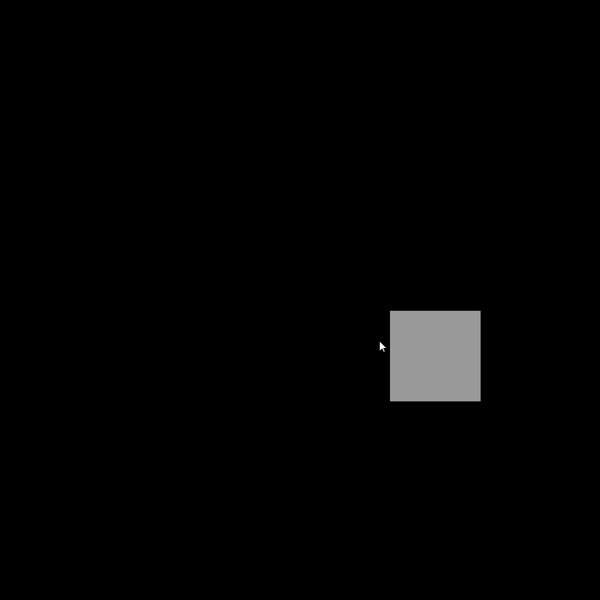

# processing-code

Simple processing examples separated by different branches.

### master branch 
As a template, it's also an example from [processing.org](https://processing.org/examples/mousefunctions.html)

