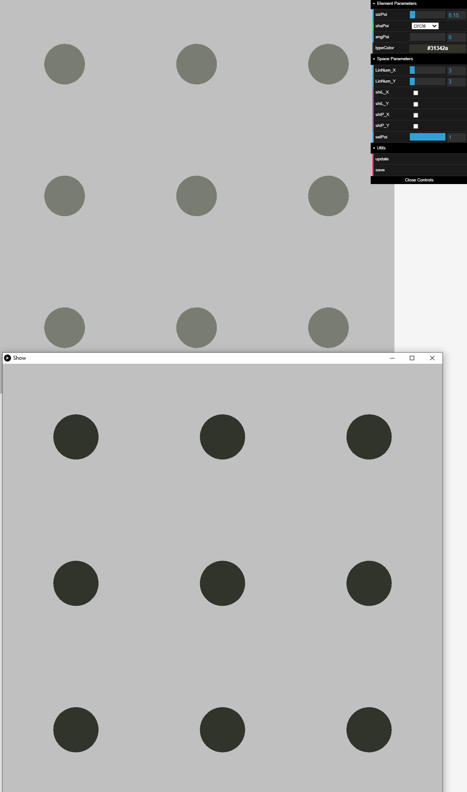
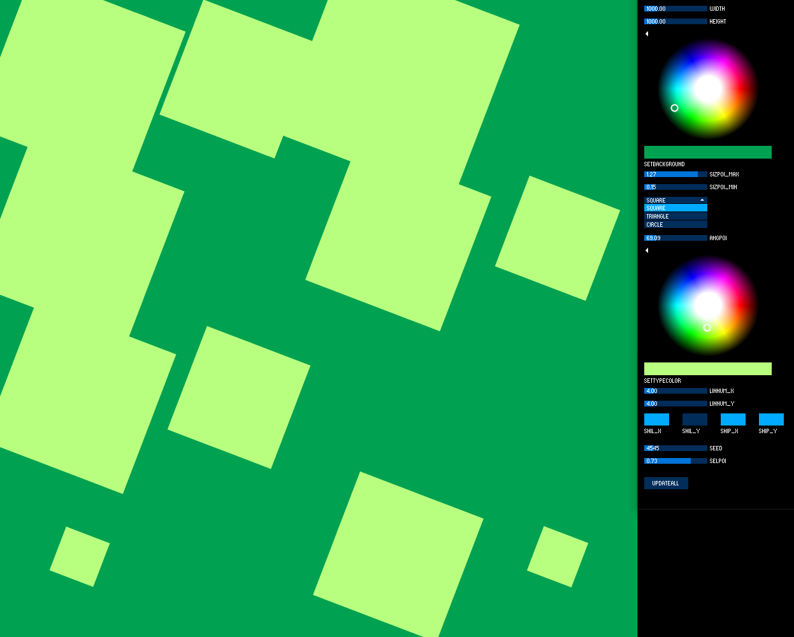

#  web-2d 
A web framework connecting processing and threejs
## Modulate
参数控制图形变化的例子，支持从dat.gui和controlP5两种图形界面输入参数。

### dat.gui 控制与 socket.io 数据传输
需要配置 [node](https://nodejs.org/en/) 环境，安装后重启 IDEA  

输入下列命令后，如果有未安装的包可用 `npm install xxx` 命令尝试安装。
``` bash
npm install
node app.js
```
每次运行之前在src目录的node文件夹上右键 `Open in Terminal`

``` bash
node app.js
```
运行Java程序后，需要从网页上点Update看到更新。



### controlP5 控制器
使用Processing库 [controlP5](http://www.sojamo.de/libraries/controlP5/) 控制参数

类 Controller 在另一个窗口提供了控制数据

