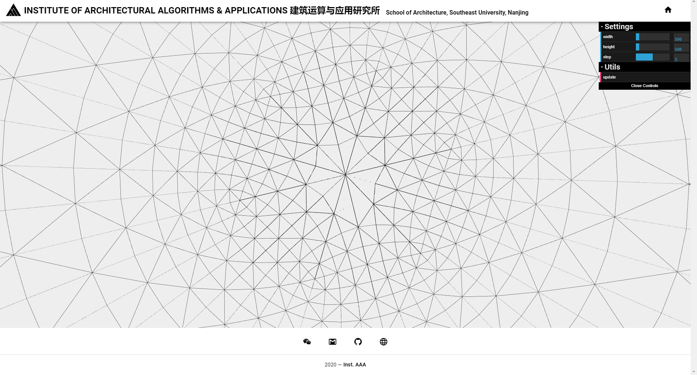

# 3d-web

web framework connecting processing and threejs

### 运行(开发)
#### 前端服务器调试
``` bash
cd src/main/3d-web
npm run serve
```
#### node 服务器
``` bash
cd src/main/3d-web/bak
# 第一次下载代码到本地
npm install 
# 运行node服务器
node app.js
```
#### Java 程序
直接运行程序 `Shift + F10`

### dat.gui 参数控制与 socket.io 数据传输
在网页前端控制参数，使用socket.io作为数据双向传输的工具，点Update看到更新。


### 运行(生产)
将程序以生产环境发布
#### 前端服务器
``` bash
cd src/main/3d-web
npm run build
```
将`bak`文件夹内容复制到`dist`中，运行
``` bash
npm install
node app.js
```
这时只需要后端java运行就可以使用网页功能了。